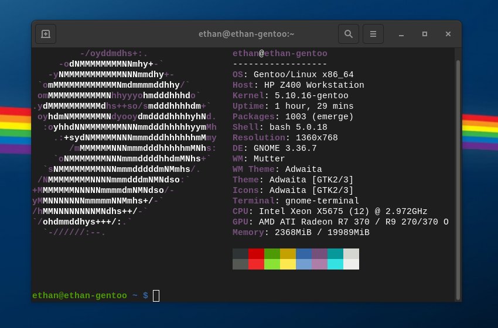

# Hello! I am Ethan Atchley! :wave:
I am a 14 year old hoping to become a software engineer in the future, and I am currently working on a couple of projects that are linux related! I am working on Dang Small Linux, and Ataraxia GNU/Linux. I also own "EZPZSoftware".

# Currently Learning:
C language
The Linux Kernel

# System specs and OS

